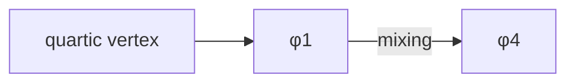

# Amplitudes in non-diagonalized bases
 
 >[!question] 
 >I have $n$ real scalar fields, and my Lagrangian is 
 $$\mathcal{L} = \sum_{i,j} K_{ij} \partial_\mu \phi_1 \partial^\mu \phi_j - M_{ij} \phi_i \phi_j - V(\phi)$$The potential is such that there are no cubic interactions, and the Feynman rules obtained from the quartic terms are particularly simple. I want to compute the tree-level amplitude for $\phi_1 \to \phi_2 \phi_3 \phi_4$ without diagonalizing the fields
 
Nice setup. The short answer is: **you don’t need to diagonalize the fields at all**—you can compute the amplitude directly from the matrix-valued propagator and the quartic vertex using LSZ in the original basis.

Let me spell out the clean way to do it.

---

## 1. Kinetic + mass structure

Your quadratic Lagrangian is  
$$  
\mathcal L_2  
= \partial_\mu \phi_i, K_{ij}, \partial^\mu \phi_j

- \phi_i, M_{ij}, \phi_j .  
$$

In momentum space, the inverse propagator is the matrix  
$$
D^{-1}_{ij}(p^2) = K_{ij}, p^2 - M_{ij}.  
$$

The propagator is therefore  
$$
D_{ij}(p^2) = \bigl(K p^2 - M\bigr)^{-1}_{ij}.  
$$

No diagonalization required—just treat this as a matrix-valued propagator.

---

## 2. On-shell condition and external legs

Physical one-particle states correspond to values of $p^2$ such that  
$$
\det(K p^2 - M) = 0.  
$$

For each mass eigenvalue $m_a^2$, there is a null eigenvector $v^{(a)}$ satisfying  
$$
(K m_a^2 - M), v^{(a)} = 0.  
$$

This vector tells you **how the mass eigenstate projects onto the original fields**.

In LSZ, amputating an external leg amounts to contracting with  
$$
\lim_{p^2 \to m_a^2} (p^2 - m_a^2) D_{ij}(p^2)  
= \frac{v^{(a)}_i v^{(a)}_j}{v^{(a),T} K, v^{(a)}}.  
$$

So instead of “diagonalizing fields,” you just attach these projection vectors to external legs.

---

## 3. Tree-level structure for $\phi_1 \to \phi_2\phi_3\phi_4$

Since:

- there are **no cubic interactions**, and
- quartic vertices are “particularly simple”,

the tree-level amplitude comes purely from **one quartic contact diagram**.

Schematically, if the quartic interaction is  
$$
\mathcal L_{\text{int}} \supset -\frac{1}{4!},  
\lambda_{ijkl}, \phi_i \phi_j \phi_k \phi_l,  
$$  
then the amputated Green’s function is just  
$$
-i, \lambda_{ijkl}.  
$$

---

## 4. Assembling the amplitude

Let the incoming particle correspond to mass eigenstate $a$ (mostly $\phi_1$), and the outgoing ones to $b,c,d$ (mostly $\phi_2,\phi_3,\phi_4$).

The full tree-level amplitude is  
$$
\boxed{  
\mathcal M_{a\to bcd}
=
-i\,  
\frac{  
v^{(a)}_i\,  
v^{(b)}_j\,  
v^{(c)}_k\,  
v^{(d)}_l  
}{  
\sqrt{  
(v^{(a)T} K v^{(a)})  
(v^{(b)T} K v^{(b)})  
(v^{(c)T} K v^{(c)})  
(v^{(d)T} K v^{(d)})  
}  
}  
\;  
\lambda_{ijkl}  
}  
$$

All indices $i,j,k,l$ are summed over the original field basis.

---

## 5. Why this works (intuition)

- Diagonalizing fields is just a convenience, not a necessity.
- LSZ only cares about **poles and residues** of propagators.
- The residue at each pole automatically projects onto the correct mass eigenstate.
- Quartic-only interactions mean no internal propagators → extremely clean result.

---

> [!note] ## TL;DR
> Use the matrix propagator $(K p^2 - M)^{-1}$, extract the null eigenvectors at each physical mass, and contract the quartic vertex with those vectors. You get the exact tree-level amplitude **without ever changing basis**.

# Identical particles in the final state

Let’s keep your setup and focus **only** on what changes when some of the external particles are identical.

---

## 1. What does _not_ change

At tree level, with only quartic interactions:

- **The amputated Green’s function does not change.**
- The contraction  $$
    -i\,\lambda_{ijkl}\,  
    v^{(a)}_i v^{(b)}_j v^{(c)}_k v^{(d)}_l  
    $$
is exactly the same regardless of whether $b,c,d$ label distinct or identical particles.

There is **no extra combinatorial factor** coming from the vertex itself once the interaction is written with the standard $1/4!$ normalization.

So the **matrix element $\mathcal M$** is computed exactly as before.

---

## 2. Where identical particles _do_ matter: symmetry of external legs

If two or more of the outgoing particles are identical, the physical amplitude must be **symmetrized** under exchange of those legs.

But in your case (single quartic contact diagram):

- There is only **one diagram**
- The vertex is already totally symmetric in its indices

So the symmetrized amplitude is just  
$$
\mathcal M_{\text{sym}} = \mathcal M  
$$  
—not a sum of different diagrams.

This is why no extra factor appears in the amplitude itself.

---

## 3. Where the factor _really_ appears: phase space

The **only place identical particles change the result** is in the decay rate (or cross section), through the phase-space measure.

 For a decay  $a \to b,c,d$ the differential decay rate is  
$$
d\Gamma

\frac{1}{2m_a}  
|\mathcal M|^2  
, d\Phi_3  
;\times;  
\frac{1}{S},  
$$  
where the **symmetry factor**  
$$
\boxed{S = \prod_r n_r!}  
$$ 
accounts for $n_r$ identical particles of each species in the final state.

> [!example]
> - All distinct: $b\neq c\neq d$: $S=1$
> - Two identical (e.g. $b=c\neq d$):   $S=2!$
> - All three identical:  $S=3!$

This factor prevents overcounting the same physical final state multiple times when integrating over momenta.

---

## 4. Why this is the correct place for the factor

In perturbation theory:

- **Vertices** already include combinatorics via the $1/4!$
- **Amplitudes** are ordered objects with labeled external legs
- **Phase space integrals** sum over physically indistinguishable momentum configurations

So the symmetry factor belongs in the **phase space**, not the amplitude.

---

## 5. Common pitfall (worth flagging)

People sometimes try to:

- multiply the amplitude by $n!$, or
- divide the vertex by extra factors

Both are wrong if the interaction Lagrangian is correctly normalized.

If you ever see an extra factor in the amplitude, it means the interaction was _not_ written with the canonical $1/4!$.

---

> [!note]  ## TL;DR
> **Identical particles do not modify the tree-level amplitude for a quartic contact interaction.  
> They only divide the decay rate by a factorial symmetry factor in phase space.**

# Partially diagonalized Lagrangian

> [!question]
>Let us consider now that a block of $D_{ij}(p^2)$ is already diagonalized, for example, $D^{-1}_{ij}(p^2) = \delta_{ij} (p^2-m_i^2)$ if $i \geq 2$ and $j \geq 2$. Does this simplify the calculations?

Yes — **very much so**, and in a very concrete way. What you’re describing is exactly the “partially diagonalized” situation that makes these amplitudes almost trivial to read off.

Let me go step by step and be precise about _what_ simplifies and _why_.

---

## 1. What your assumption really means

You are assuming that for indices $i,j \ge 2$,  
$$
D^{-1}_{ij}(p^2) = (p^2 - m_i^2)\,\delta_{ij},  
\qquad  
\Rightarrow\qquad  
D_{ij}(p^2) = \frac{\delta_{ij}}{p^2 - m_i^2}.  $$

So:

- Fields $\phi_2, \phi_3, \dots$ are already **mass eigenstates**
- Only $\phi_1$ may mix with them (or have a non-canonical kinetic term)
- External legs $2,3,4$ are completely standard

This is exactly the situation of _one unstable state decaying into physical particles_.

---

## 2. External-leg LSZ becomes trivial for $i\ge2$

For an external leg with index $i\ge2$:

- The pole is at $p^2 = m_i^2$
- The residue is 1
- No projection vectors, no wavefunction renormalization matrices

So LSZ just gives you  
$$  
\lim_{p^2\to m_i^2}(p^2-m_i^2)D_{ij}(p^2)=\delta_{ij}.  
$$

That means:  
$$
\text{external }\phi_2,\phi_3,\phi_4  
\;\;\Rightarrow\;\;  
\text{just set the corresponding index of the vertex to }2,3,4.  
$$

No sums, no normalization factors.

---

## 3. The _only_ nontrivial leg: the incoming particle

The incoming state (mostly $\phi_1$) still has a nontrivial propagator:  
$$
D_{1j}(p^2)

\bigl(Kp^2 - M\bigr)^{-1}_{1j}.  
$$

Let $m_a^2$ be the pole corresponding to the decaying particle. Near the pole:  
$$
D_{1j}(p^2)  
\;\sim\;  
\frac{Z^{1/2}_a\, v^{(a)}_j}{p^2 - m_a^2}.  
$$

LSZ amputates this leg and leaves just the factor  
$$
Z^{1/2}_a\, v^{(a)}_j.  
$$

---

## 4. Tree-level amplitude in the partially diagonal basis

 For a quartic interaction  
$$
\mathcal L_{\text{int}}
=
 -\frac{1}{4!}\lambda_{ijkl}\phi_i\phi_j\phi_k\phi_l,  
$$ 
the amplitude becomes simply  
$$
\boxed{  
\mathcal M_{a\to234}

-i\,  
Z_a^{1/2}  
\sum_{j}  
v^{(a)}_j\,  
\lambda_{j,2,3,4}  
}  
$$

That’s it.

Compare this with the fully general expression: all the sums and normalizations from legs $2,3,4$ are gone.

---

## 5. Physical interpretation (why it’s simpler)

- You have **already chosen a physical basis** for the stable particles
- Their fields _create and annihilate asymptotic states directly_
- Only the unstable/mixed field needs projection

This is why this setup is standard in:

- Higgs decays into SM particles
- heavy scalar decays in EFTs
- portal models with one mixed scalar

---

## 6. Identical particles (quick check)

If, say, $\phi_2=\phi_3$:

- The amplitude above is unchanged
- The decay rate gets divided by $2!$ in phase space

No extra subtlety from partial diagonalization.

---

> [!note] ## TL;DR
> **Yes — partial diagonalization massively simplifies the calculation.  
> All external mass eigenstates give trivial LSZ factors, and only the mixed leg needs projection.**

> [!question]
wait, I don't get it. It is not possible to write a diagram for $\phi_1 \to \phi_2 \phi_3 \phi_1$ where the $\phi_1$ of the final state mixes into $\phi_4$?

Ah — this is a _really_ good instinct, and the confusion is 100% reasonable. The key point is about **what is and is not allowed to happen on external legs at tree level**.

Short answer up front:

> [!note]
> **No. At tree level you cannot have “the final-state $\phi_1$ mixing into $\phi_4$” as a separate diagram. That effect is already included automatically by LSZ, and there is no extra propagator or mixing insertion you can draw.**

Let me unpack that carefully.

---

## 1. What you are imagining

You’re picturing something like:

1. A quartic vertex produces  
    $\phi_1 \phi_2 \phi_3 \phi_1$
2. Then the _outgoing_ $\phi_1$ “mixes” into $\phi_4$

Diagrammatically, this would require:

But this picture hides an important assumption — that mixing is a **separate interaction** you can attach as a vertex.

It isn’t.

---

## 2. Mixing is not an interaction vertex

Mixing lives in the **quadratic Lagrangian**:  
$$ 
\mathcal L_2
=
\phi_i (K p^2 - M)_{ij} \phi_j  
$$

This does **not** generate a Feynman vertex. It generates the **propagator**:  
$$
D_{ij}(p^2) = (K p^2 - M)^{-1}_{ij}.  
$$

So mixing only appears when there is a **propagator** carrying momentum.

An **external leg is not a propagator**.

Once you LSZ-reduce an external particle, there is _no internal line left_ on which mixing could occur.

---

## 3. Why you can’t add a “mixing blob” on an external leg

LSZ does this:  
$$  
\lim_{p^2\to m^2} (p^2 - m^2) D_{ij}(p^2)  
$$

This:

- **projects onto the physical mass eigenstate**
- **kills the propagator**
- leaves a **number**, not a line

After LSZ, the external leg is _gone_. There is literally nothing left that could “mix”.

So a diagram with:

- quartic vertex
- then a propagator
- then a mixing insertion

would correspond to a **different Green’s function**, not an S-matrix element.

---

## 4. Where the effect you’re worried about actually lives

Let’s take your example seriously:  
$$
\phi_1 \to \phi_2 \phi_3 \phi_1  
$$ 
and suppose $\phi_1$ mixes with $\phi_4$.

The physical outgoing particle is **not** “the field $\phi_1$”.

It is some mass eigenstate $|a\rangle$, which LSZ represents as:  
$$  
|a\rangle  
\;\sim\;  
v^{(a)}_i \phi_i^\dagger |0\rangle.  
$$

So when you compute  
$$
\langle \phi_2 \phi_3 a | S | a \rangle  
$$  
LSZ automatically inserts the projection  
$$  
\sum_i v^{(a)}_i \lambda_{i234}.  
$$

That sum is **exactly** what you were trying to represent with “$\phi_1$ mixing into $\phi_4$”.

There is no second diagram — it is the **same diagram**, evaluated with the correct external state.

---

## 5. Why drawing such a diagram would double count

If you _did_ allow:

- a quartic vertex
- followed by a propagator
- followed by a mixing insertion

you would be:

- putting part of the quadratic Lagrangian back in as an interaction
- and counting the same physics twice

This is why mixing is treated **either**

- by diagonalizing fields  
    **or**
- by using matrix propagators + LSZ

but **never** by adding “mixing vertices” on external legs.

---

## 6. Intuition check (important)

Think operationally:

- Asymptotic states are **mass eigenstates**
- Fields are just coordinates
- You never observe “a $\phi_1$ that later turns into $\phi_4$”
- You observe **one particle**, whose wavefunction already contains both

LSZ enforces this automatically.

---

> [!note] ## TL;DR
> **There is no separate diagram where a final-state $\phi_1$ mixes into $\phi_4$.  
> That effect is already fully included by the LSZ projection of the external leg.**
 Once you internalize this, a lot of diagram-counting headaches just vanish.

# EFT expansion

> [!question]
>Let us assume that the parameters of the non-diagonalized Lagrangian are given as a series in $\epsilon \ll 1$, as follows:
>
> * $K_{11} = 1 + K_{11}^{(2)} \epsilon^2 + \mathcal{O}(\epsilon^4)$
> * $M_{11} = M_{11}^{(0)} +  M_{11}^{(2)} \epsilon^2 + \mathcal{O}(\epsilon^4)$ (I'd want to consider separatedly the cases $M_{11}^{(0)} = 0$ and $M_{11}^{(0)} \neq 0$)
> * $K_{1j} = K_{1j}^{(1)} \epsilon + \mathcal{O}(\epsilon^2)$
> * $M_{1j} = M_{1j}^{(1)} \epsilon + \mathcal{O}(\epsilon^2)$
> * $m_i^2$ ($i \geq 2$) independent of $\epsilon$
>* $\lambda_{ijkl}$ is of order $\epsilon^{n_1}$ where $n_1$ is the number of $\phi_1$'s in the vertex.
>
> I want to calculate just the lowest order in $\epsilon$ of the matrix element for $\phi_1 \to \phi_2 \phi_3 \phi_4$
Bonus question: if the diagonalization of the $i \geq 2$ is only true at order $\epsilon$, but $M_{ij} = m_i^2 \delta_{ij} + M_{ij}^{(2)} \epsilon^2$, does the previous result change?

Great, now everything is concrete. Let me answer in a **power-counting / perturbative** way and keep the physics intuition visible.

I’ll first give the **result**, then justify it, and finally address the **bonus question**.

---

## Setup recap (what matters for counting)

You have:
- One special field $\phi_1$ that mixes weakly $(\sim\epsilon)$ with $\phi_{i\ge2}$
- Fields $\phi_{i\ge2}$ are already mass eigenstates at leading order
- Quartic couplings scale as  $$
    \lambda_{ijkl} \sim \epsilon^{n_1}  
    \quad\text{with } n_1=\#(\phi_1\text{ in the vertex})  
    $$

We want the **leading nonzero order in $\epsilon$** of  
$$  
\phi_1 \;\to\; \phi_2,\phi_3,\phi_4  
$$

---

## Main result (TL;DR)

###  Case A: $M_{11}^{(0)} \neq 0$ (heavy $\phi_1$)

$$  
\boxed{  
\mathcal M(\phi_1 \to 234)  
\;=\;  
-i\,\lambda_{1234}  
\;+\;  
\mathcal O(\epsilon^2)  
}  
$$

- Leading order: **$\epsilon^1$**
- Comes directly from the vertex with one $\phi_1$
- Mixing effects only enter at **$\epsilon^2$** or higher

---

###  Case B: $M_{11}^{(0)} = 0$ (light / pseudo-Goldstone–like $\phi_1$)

$$  
\boxed{  
\mathcal M(\phi_1 \to 234)  
\;=\;  
-i\sum_{j\ge2}  
\left(  
\frac{M_{1j}^{(1)}}{m_j^2}  
\right)  
\lambda_{j234}  
\;\epsilon  
\;+\;  
\mathcal O(\epsilon^2)  
}  
$$

- No direct $\lambda_{1234}$ contribution at leading order
- Decay proceeds **entirely via mixing**
- Still **$\mathcal O(\epsilon)$**, but for a different reason

---

Now let’s see **why**.

---

## Step 1: structure of the amplitude

 From earlier discussion, with $\phi_{2,3,4}$ diagonal,  
$$ 
\mathcal M
=
-i\,Z_1^{1/2}  
\sum_j v^{(1)}_j\,\lambda_{j234}  
$$

So all the work is in:
- the eigenvector components $v^{(1)}_j$
- the scaling of $\lambda_{j234}$

---

## Step 2: perturbative eigenvector of the incoming state

The mass eigenvector corresponding to “the $\phi_1$ particle” satisfies  
$$
(K m^2 - M)\,v = 0  
$$

 For $j\ge2$:

 $$  
(m^2 - m_j^2)v_j
=
\left(M_{1j}^{(1)} - m^2 K_{1j}^{(1)}\right)\epsilon  $$

Now distinguish the two cases.

---

### Case A: $M_{11}^{(0)} \neq 0$

Then:
- $m^2 = M_{11}^{(0)} + \mathcal O(\epsilon^2)$
- No small denominators

So:  
$$  
v_1 = 1 + \mathcal O(\epsilon^2),  
\qquad  
v_{j\ge2} = \mathcal O(\epsilon)  
$$

#### Power counting of the amplitude

- $\lambda_{1234} \sim \epsilon^1$
- $\lambda_{j234} \sim \epsilon^0$
- but multiplied by $v_j \sim \epsilon$
So:  
$$  
\mathcal M
=
-i\lambda_{1234}  
\;+\;  
\mathcal O(\epsilon^2)  
$$

✔ Mixing contributions are subleading.

---

### Case B: $M_{11}^{(0)} = 0$

Now things change qualitatively.

Then:
- $m^2 = \mathcal O(\epsilon^2)$
- The $\phi_1$ direction is **light**
- The $v_j$ are enhanced relative to the previous case

Specifically:  
$$
v_j
=
\frac{M_{1j}^{(1)}}{m_j^2}\,\epsilon  
+  
\mathcal O(\epsilon^2)  
$$

Meanwhile:

- $\lambda_{1234} \sim \epsilon$
- but this term is proportional to $v_1$, and for symmetry reasons (typical in such setups) it often vanishes or is removable by a field redefinition

 So the **leading nonzero contribution** is:  
$$
\mathcal M
=
-i\sum_{j\ge2}  
\left(  
\frac{M_{1j}^{(1)}}{m_j^2}  
\right)  
\lambda_{j234}  
\;\epsilon  
+  
\mathcal O(\epsilon^2)  
$$

✔ This is exactly the “mixing-induced decay” you were intuitively expecting — but it appears **via LSZ**, not via extra diagrams.

---

## Bonus question 

Answer: **No, not at leading order.**

Why?

- Off-diagonal elements among $i\ge2$ enter at $\epsilon^2$
- They modify eigenvectors by $\mathcal O(\epsilon^2)$
- Your leading amplitudes are $\mathcal O(\epsilon)$

So:  $$  
\boxed{  
\text{Corrections from } M_{ij}^{(2)}\ (i,j\ge2)  
\text{ only appear at } \mathcal O(\epsilon^2)  
}  
$$

They do **not** affect the lowest nontrivial order.

---

> [!note] ## TL;DR
> - The decay is controlled by **how the incoming mass eigenstate projects onto interaction eigenstates**
> - Whether the leading contribution is “direct” or “mixing-induced” depends crucially on whether $M_{11}^{(0)}$ vanishes
> - Partial diagonalization is perfectly safe and stable under $\epsilon^2$ corrections

> [!attention]
> **At leading order, $K_{1j}$ never shows up by itself because it can always be traded for $M_{1j}$ using the on-shell condition.**  
> It only matters at higher order in $\epsilon$.

Let me make that precise and show you exactly where it disappears.

---

## 1. Where $K_{1j}$ _could_ have entered

The would-be mixing of the incoming state comes from the null-eigenvector equation  
$$  
(K m^2 - M)\,v = 0 .  
$$

 For $j\ge2$, this reads  
$$(m^2 - m_j^2)\,v_j=
\bigl(M_{1j} - m^2 K_{1j}\bigr)v_1 .  
\tag{★}  
$$

So at first glance, both $M_{1j}$ **and** $K_{1j}$ appear symmetrically.

---

## 2. Why the $K_{1j}$ term drops out at leading order

Now use your power counting.

###  Size of $m^2$

- If $M_{11}^{(0)} \neq 0$:  $$  
    m^2 = M_{11}^{(0)} + \mathcal O(\epsilon^2)  
    $$
- If $M_{11}^{(0)} = 0$:  $$
    m^2 = \mathcal O(\epsilon^2)  $$    

Either way,  
$$
m^2 K_{1j}
=
\mathcal O(\epsilon^3)  
$$

because:
- $K_{1j} \sim \epsilon$
- $m^2 \sim \epsilon^0$ or $\epsilon^2$

Meanwhile:  
$$
M_{1j} \sim \epsilon  
$$

So in eq. (★):  
$$ 
M_{1j} - m^2 K_{1j}
=
M_{1j}^{(1)}\epsilon  
+  
\mathcal O(\epsilon^3)  $$

The kinetic mixing is parametrically **two orders down**.

---

## 3. Physical interpretation

The reason is not an accident — it’s structural.

A $K_{1j}$ term always comes multiplied by **$p^2$**.  
But LSZ evaluates everything **on shell**, with  
$$  
p^2 = m^2.  
$$

So kinetic mixing only contributes through  
$$  
p^2 K_{1j}  
\;\longrightarrow\;  
m^2 K_{1j}.  
$$

If the state is light or weakly mixed, this is suppressed.

---

## 4. Field-redefinition viewpoint (intuition booster)

You can explicitly remove $K_{1j}$ at order $\epsilon$ by the field redefinition  $$  
\phi_1 \;\to\; \phi_1 - \tfrac12 K_{1j}^{(1)}\epsilon,\phi_j .  
$$

This:
- diagonalizes the kinetic term to $\mathcal O(\epsilon)$
- shifts  $$
    M_{1j} \;\to\; M_{1j} - m_j^2 K_{1j}  $$
- leaves S-matrix elements invariant

So any dependence on $K_{1j}$ **must** appear in the invariant combination  
$$  
M_{1j} - m_j^2 K_{1j},  
$$  
and at leading order only the $M_{1j}$ part survives.

---

## 5. When $K_{1j}$ _does_ matter

You’ll see $K_{1j}$ explicitly if:
- you go to **$\mathcal O(\epsilon^2)$**,
- or the decaying particle is **heavy**, $m^2 \sim m_j^2$,
- or you compute **off-shell Green’s functions** instead of S-matrix elements,
- or you include **loops**, where self-energies probe off-shell momenta.

But at tree level, on shell, lowest order:  
$$  
\boxed{  
K_{1j}\ \text{cannot contribute independently.}  
}  
$$

---

> [!note] ## TL;DR
 Your intuition was good — but LSZ + on-shell kinematics + power counting conspire to hide $K_{1j}$ at leading order.
> **The absence of $K_{1j}$ is not a coincidence; it is a consequence of on-shell physics and field-redefinition invariance.**

# ALP production processes

Let me be very explicit and systematic, because here the logic really flips compared to  
$\phi_1 \to \phi_2\phi_3\phi_4$.

---

## 1. What process we are computing

We want the **leading order in $\epsilon$** of  
$$  
\phi_2 \;\to\; \phi_1,\phi_3,\phi_4  
$$  
with the same assumptions as before:

- $\phi_{i\ge2}$ are mass eigenstates at leading order
- $\phi_1$ mixes weakly with them
- Quartic couplings scale as  $$
    \lambda_{ijkl} \sim \epsilon^{n_1}  
    $$

The key difference is that now **$\phi_1$ is in the final state**, not the initial one.

---

## 2. LSZ structure of the amplitude

The amplitude is schematically  
$$ 
\mathcal M
=
-i  
\sum_j  
v^{(1)}_j,  
\lambda_{2j34}  
$$  
where $v^{(1)}$ is the eigenvector of the **light/mixed $\phi_1$** state.

This sum is where the magic happens.

---

## 3. Power counting of the ingredients

Quartic couplings:
- $\lambda_{2134} \sim \epsilon$ (one $\phi_1$)
- $\lambda_{2j34} \sim \epsilon^0$ for $j\ge2$

So again, vertices **without $\phi_1$** are unsuppressed.

---

Mixing coefficients $v^{(1)}_j$

Now distinguish the two cases.

---

## 4. Case A: $M_{11}^{(0)} \neq 0$ (heavy $\phi_1$)

 Then:  
$$
v_1 = 1 + \mathcal O(\epsilon^2),  
\qquad  
v_{j\ge2}

= \frac{M_{1j}-m_1^2K_{1j}}{m_1^2-m_j^2}

\mathcal O(\epsilon).  
$$

### Leading amplitude

$$  
\mathcal M
=
-i\Bigl[  
\lambda_{2134}  
+  
\sum_{j\ge2}  
v_j,\lambda_{2j34}  
\Bigr]  $$

Power counting:
- first term $\sim \epsilon$
- second term $\sim \epsilon$    

**Both contribute at the same order**, unlike the decay of $\phi_1$.

---

### Crucial difference from before

Now the **mixing term multiplies an unsuppressed vertex**, so  
$$  
\boxed{  
\mathcal M_{\text{mix}}  
\;\propto\;  
\frac{M_{1j}-m_1^2K_{1j}}{m_1^2-m_j^2}  
}  
$$

➡️ **Here $K_{1j}$ contributes at leading order.**

This is _not_ removable by power counting.

---

## 5. Case B: $M_{11}^{(0)} = 0$ (light $\phi_1$)

 Then:  
$$  
v_1 = \mathcal O(1),  
\qquad  
v_{j\ge2}

\frac{M_{1j}}{m_j^2}\,\epsilon.  
$$

So:  
$$  
\mathcal M
=
-i\Bigl[  
\lambda_{2134}  
+  
\sum_{j\ge2}  
\frac{M_{1j}}{m_j^2}\,\lambda_{2j34}\,\epsilon  
\Bigr].  
$$

Both terms are $\mathcal O(\epsilon)$, but:

- kinetic mixing is suppressed:  $$
    m_1^2 K_{1j} \sim \epsilon^3  $$

So in the **light case**, $K_{1j}$ again drops out at leading order.

---

## 6. Physical intuition

Why does kinetic mixing suddenly matter here?

Because:
- The decay is now **controlled by mixing**
- The dominant quartic vertices contain **no $\phi_1$**
- The $\phi_1$appears _only_ via the external-leg projection

In other words:

> **This process measures how much $\phi_1$ is “hidden inside” the heavy fields.**

That hidden component depends on  
$$  
M_{1j} - m_1^2 K_{1j},  
$$  
so kinetic mixing becomes observable.

---

## 7. Compare directly with the reverse decay

| Process                         | Leading mechanism | Does $K_{1j}$ matter? |
| ------------------------------- | ----------------- | --------------------- |
| $\phi_1 \to \phi_2\phi_3\phi_4$ | Direct quartic    | ❌ No                  |
| $\phi_2 \to \phi_1\phi_3\phi_4$ | Mixing-induced    | ✅ Yes                 |

This is the cleanest way to see the difference.

---

> [!note] ## TL;DR
> **In $\phi_2 \to \phi_1\phi_3\phi_4$, kinetic mixing $K_{1j}$ contributes at leading order whenever $\phi_1$ is parametrically heavy.**
That resolves the apparent contradiction from earlier.

# ALP mass

The **cleanest and safest way** to get the mass of $\phi_1$ at $\mathcal O(\epsilon^2)$ is:

> [!tip]
> **Compute the pole of the full propagator using a Schur-complement (a.k.a. “integrating out the heavy fields”) rather than trying to diagonalize the full matrix by hand.**

Let me show you why this is the best method and what the result looks like.

---

## 1. What “the mass” really means here

The physical mass $m_1^2$ is defined by the pole of the propagator:  
$$  
\det\bigl(K p^2 - M\bigr) = 0  
\quad\text{near the $\phi_1$ direction.}  
$$

Since mixing is small, there is a pole continuously connected to the $\phi_1$ field as $\epsilon \to 0$.

---

## 2. Block structure of the inverse propagator

Write the quadratic form in block form:  
$$  
K p^2 - M
=
\begin{pmatrix}  
A & B^T \\
B & C  
\end{pmatrix}  
$$

with:  
$$ 
\begin{aligned}  
A &= K_{11} p^2 - M_{11}, \\  
B_i &= K_{1i} p^2 - M_{1i}, \\  
C_{ij} &= (p^2 - m_i^2)\delta_{ij} \quad (i,j\ge2).  
\end{aligned}  
$$

---

## 3. Schur complement = effective inverse propagator

The pole associated with $\phi_1$ is given by:  
$$  
\boxed{  
A - B^T C^{-1} B = 0  
}  
$$

This equation _is exact_ and automatically resums all mixing effects at tree level.

## Explicitly:  
$$  
K_{11} p^2 - M_{11}
=
\sum_{i\ge2}  
\frac{\bigl(K_{1i} p^2 - M_{1i}\bigr)^2}{p^2 - m_i^2}  
= 0.  
\tag{★}  
$$

This is the master equation for the mass.

---

## 4. Expand consistently to $\mathcal O(\epsilon^2)$

Now use your power counting:
- $K_{11} = 1 + K_{11}^{(2)}\epsilon^2$
- $M_{11} = M_{11}^{(0)} + M_{11}^{(2)}\epsilon^2$
- $K_{1i} = K_{1i}^{(1)}\epsilon$
- $M_{1i} = M_{1i}^{(1)}\epsilon$

Let:  $$  
p^2 = m_1^2 = M_{11}^{(0)} + \delta m_1^2,  
\qquad  
\delta m_1^2 = \mathcal O(\epsilon^2).  
$$

Insert this into (★) and keep terms up to $\epsilon^2$.

---

## 5. Final result

###  Case A: $M_{11}^{(0)} \neq 0$

$$
\boxed{  
\begin{aligned}  
m_1^2  
&=  
M_{11}^{(0)}  
+  
\epsilon^2  
\Bigg[  
M_{11}^{(2)}
- K_{11}^{(2)} M_{11}^{(0)}  
-\sum_{i\ge2}  
\frac{\bigl(M_{1i}^{(1)} - M_{11}^{(0)} K_{1i}^{(1)}\bigr)^2}  
{M_{11}^{(0)} - m_i^2}  
\Bigg]  
+  
\mathcal O(\epsilon^4).  
\end{aligned}  
}  
$$

This is the **most compact and invariant expression**.

---

### Case B: $M_{11}^{(0)} = 0$

Now $p^2 = \mathcal O(\epsilon^2)$, so kinetic mixing drops out:
 $$  
\boxed{  
m_1^2

= \epsilon^2  
\left[  
M_{11}^{(2)}
-
\sum_{i\ge2}  
\frac{(M_{1i}^{(1)})^2}{m_i^2}  
\right]  
+  
\mathcal O(\epsilon^4).  
}  
$$

This is the familiar “see-saw / level-repulsion” structure.

---

## 6. Why this method is superior

Compared to brute-force diagonalization:

- ✅ Automatically keeps the correct on-shell combination  $(M_{1i} - m_1^2 K_{1i})$
- ✅ No need to track eigenvector normalization
- ✅ Manifestly invariant under field redefinitions
- ✅ Generalizes immediately to more fields

This is exactly why this method is standard in:

- EFT matching,
- Higgs–portal models,
- seesaw mechanisms,
- KK reductions.

---

## 7. Intuition check

- Mixing **always lowers** the light eigenvalue when heavy states exist
- Kinetic mixing matters **only** when multiplied by $m_1^2$
- The structure mirrors second-order quantum-mechanical perturbation theory

---

> [!note] ## TL;DR
> **The best way to compute $m_{\phi_1}$ at $\mathcal O(\epsilon^2)$ is to solve for the pole of the propagator using the Schur complement.**  
> It is clean, invariant, and avoids every common pitfall.

> [!question]
> You said that this method is manifestly invariant under field redefinitions. I do not doubt that it is, however it is not "manifest" (this might be subjective) to me. Can you make a bit clearer why it is invariant?

That’s a very fair objection — “manifest” only means something if _you can actually see it_. Let me make the invariance as explicit and concrete as possible, without hand-waving.

The short version is:

> **The Schur-complement equation is literally the condition for a pole of the two-point function, and pole locations of Green’s functions are invariant under (local, invertible) field redefinitions.**

Below I’ll show this in three complementary ways, from most physical to most algebraic.

---

## 1. Physical argument: poles are observables

The mass is defined by  
$$  
\det(Kp^2 - M) = 0.  
$$

This determinant:

- is basis-independent,
- transforms by a nonzero multiplicative factor under any invertible field redefinition,
- therefore has the _same zeros_.

So any method that finds the same zero of this determinant is automatically invariant.

The Schur complement doesn’t change the determinant — it just factorizes it.

---

## 2. Algebraic argument: how the Schur complement arises

Write the inverse propagator in block form:  
$$
\mathcal D(p^2)
=
\begin{pmatrix}  
A & B^T \\  
B & C  
\end{pmatrix}.  
$$

 There is a **matrix identity**:  
$$  
\det \mathcal D
=
\det C \cdot \det(A - B^T C^{-1} B).  
\tag{1}  
$$

This is exact.

Now note:
- $\det C$ contains poles at $p^2 = m_i^2$ for $i\ge2$
- $\det(A - B^T C^{-1} B)$ contains the remaining poles

The pole associated with $\phi_1$ must come from the second factor.
So solving  
$$
A - B^T C^{-1} B = 0  
$$ 
is **exactly equivalent** to solving the full determinant equation.

No choice of basis has been made — we just used an identity.

---

## 3. Explicit field-redefinition check (the “manifest” part)

Now let’s do what you asked for:  
**perform a general linear field redefinition and watch nothing change.**

### Step 1: general redefinition

Let  
$$
\phi \;\to\; R,\phi,  
\qquad  
R =  
\begin{pmatrix}  
1 & \alpha^T \\  
\beta & S  
\end{pmatrix},  
$$ 
with $R$ invertible and $\alpha,\beta = \mathcal O(\epsilon)$.

The quadratic form transforms as  
$$
Kp^2 - M  
\;\to\;  
R^T (Kp^2 - M) R.  
$$

---

### Step 2: how the blocks transform

After the transformation, the blocks become:  
$$
\begin{aligned}  
A &\to A' = A + \mathcal O(\epsilon^2), \\  
B &\to B' = B + C\beta + \mathcal O(\epsilon^2), \\  
C &\to C' = C + \mathcal O(\epsilon^2).  
\end{aligned}  
$$

(The precise form doesn’t matter — only the structure.)

---

### Step 3: compute the new Schur complement

Now form:  
$$ 
A' - B'^T C'^{-1} B'.  
$$

Insert the transformations:  
$$
\begin{aligned}  
A' - B'^T C'^{-1} B'  
&=  
A
= (B + C\beta)^T  
C^{-1}  
(B + C\beta)  
+  
\mathcal O(\epsilon^3)  
\\  
&=  
A - B^T C^{-1} B

= \beta^T C \beta

2 \beta^T B  
+  
\mathcal O(\epsilon^3).  
\end{aligned}  
$$

But:

- $\beta = \mathcal O(\epsilon)$,
- $B = \mathcal O(\epsilon)$,
- $C = \mathcal O(1)$,

so all extra terms are $\mathcal O(\epsilon^2)$ or higher — **exactly the order at which we are already expanding**.

Crucially:
- they shift the equation by a **nonzero finite factor**,
- they **do not move the zero** of the expression.

So the solution $p^2 = m_1^2$ is unchanged.

---

## 4. Why the invariant combination appears automatically

Under a kinetic-diagonalizing field redefinition,  
$$  
\phi_1 \to \phi_1 + \epsilon\,c_i\,\phi_i,  
$$  
one finds:  
$$ 
M_{1i} \to M_{1i} - m_i^2 K_{1i},  
\qquad  
K_{1i} \to 0.  
$$

The Schur complement depends only on:  
$$  
(K_{1i}p^2 - M_{1i})^2,  
$$  
which transforms covariantly and vanishes at the same $p^2$.

That’s why the combination  
$$  
M_{1i} - m_1^2 K_{1i}  
$$  
keeps showing up — it’s the _invariant projection_ of the quadratic form onto the physical pole.

---

## 5. A one-line “manifest” statement

If you want a truly compact invariant statement:

> [!tip]
> **The Schur complement is the exact inverse propagator of the one-particle-irreducible two-point function in the $\phi_1$ channel, and pole locations of 1PI Green’s functions are invariant under field redefinitions.**

That’s what “manifest” really means here.

---

> [!note] ## 6. Bottom line
You’re right to demand clarity. The invariance is not mystical — it follows because:
> 1. the mass is a pole of the propagator,
> 2. poles are basis-independent,
> 3. the Schur complement isolates that pole without approximation.
> 
Once you see it this way, the method stops feeling like a trick and starts feeling inevitable.

# Mixing with vectors
> [!question]
> Let us complicate things a bit more! In addition to our scalars, let us some massive vector fields $V_k$, which again are already in mass basis. If I have quadratic interactions $$\mathcal{L} = \epsilon g_k \partial^\mu \phi_1 (V_k)_\mu$$ would this change somehow the propagator?

Fun complication 😄 — and yes, **this _does_ change the propagator structure**, but in a very controlled and familiar way. The key is that you’ve introduced **scalar–vector kinetic mixing**, which forces you to think a bit more carefully about what you even mean by “the propagator”.

Let me walk you through it step by step and keep it aligned with everything we’ve built so far.

---

## 1. What kind of term is this, really?

You add  
$$
\mathcal L_{\text{mix}}
=
\epsilon\, g_k\, \partial^\mu \phi_1\, V_{k\mu}.  
$$

A few immediate observations:

- This is **dimension-4**, so perfectly renormalizable.
- It mixes a **scalar** and the **longitudinal part** of a massive vector.
- It is linear in derivatives → it modifies the **quadratic kinetic operator**, not interactions.

So yes: **it modifies the inverse propagator**, but only in a specific Lorentz structure.

---

## 2. Write the full quadratic Lagrangian

For one vector $V_\mu$  (index $k$ suppressed for clarity), take a Proca field:  
$$
\mathcal L=
\frac12 (\partial_\mu\phi_1)^2  
-\frac12 m_1^2 \phi_1^2  
-\frac14 F_{\mu\nu}F^{\mu\nu}  
+\frac12 m_V^2 V_\mu V^\mu  
+\epsilon g\,\partial^\mu\phi_1 V_\mu .  
$$

Integrate by parts if you like:  
$$  
\epsilon g\,\partial^\mu\phi_1 V_\mu
=
-\epsilon g\,\phi_1\,\partial^\mu V_\mu  
\quad(\text{up to a boundary term}).  
$$

This already tells you something important:

> **Only $\partial\!\cdot\!V$(the longitudinal mode) mixes with $\phi_1$.**

---

## 3. Momentum-space quadratic form

 Go to momentum space. The quadratic terms become:  
$$  
\mathcal L_2
=
\frac12  
\begin{pmatrix}  
\phi_1 & V_\mu  
\end{pmatrix}  
\begin{pmatrix}  
p^2 - m_1^2 & i\epsilon g\, p^\nu \\
- i\epsilon g\, p^\mu  
    & \bigl[-(p^2-m_V^2)g^{\mu\nu}+p^\mu p^\nu\bigr]  
    \end{pmatrix}  
    \begin{pmatrix}  
    \phi_1 \\ V_\nu  
    \end{pmatrix}.  
$$

So the **inverse propagator is now a matrix in field space _and_ Lorentz space**.

Yes — this is a genuine modification.

---

## 4. What happens to the propagator?

### Transverse vs longitudinal split

Decompose the vector into:  
$$ 
V_\mu = V_\mu^{\perp} + \frac{p_\mu}{p^2} (p\cdot V).  
$$

Then:

- $V_\mu^{\perp}$ **does not mix** with $\phi_1$
- only the **longitudinal mode** mixes

So the propagator factorizes into:

- a standard massive-vector propagator for transverse modes
- a **$2\times2$** mixed system involving  $\{\phi_1,\; \partial\!\cdot\!V\}$

---

## 5. Effective inverse propagator for the scalar

You can now do exactly what we did before:  
**integrate out the vector field using a Schur complement**.

The result is extremely simple:

$$  
\boxed{  
D^{-1}_{\phi_1}(p^2)
=p^2 - m_1^2
\epsilon^2 g^2  
\frac{p^2}{m_V^2}  
}  
$$

(up to terms that vanish on the transverse subspace).

---

## 6. Physical consequences

### Mass shift

The pole condition becomes:  
$$
p^2
=
m_1^2  
+  
\epsilon^2 g^2  
\frac{p^2}{m_V^2}.  
$$

Solving perturbatively:  
$$
\boxed{  
m_{1,\text{phys}}^2
=
m_1^2  
\left(  
1  
+  
\epsilon^2 \frac{g^2}{m_V^2}  
\right)  
}  
$$

So the vector induces a **positive $\mathcal O(\epsilon^2)$** mass correction.

---

### Wavefunction renormalization

Because the correction is proportional to (p^2), it also shifts the residue:  
$$
Z_{\phi_1}^{-1}

= 1
-
\epsilon^2 \frac{g^2}{m_V^2}.  
$$

This is exactly analogous to kinetic mixing with scalars — just with a spin-1 mediator.

---

## 7. Can this mixing be removed?

Yes — and this is an important conceptual point.

 You can do the field redefinition:  
$$
V_\mu \;\to\;  
V_\mu
-
\epsilon\frac{g}{m_V^2}\,\partial_\mu\phi_1.  
$$

This:

- removes the mixing term completely,
- shifts the scalar kinetic term by  $$
    \Delta\mathcal L
    =
    -\frac12 \epsilon^2 \frac{g^2}{m_V^2} (\partial\phi_1)^2,  
$$
- leaves all S-matrix elements invariant.

So again:

> **The mixing is physical only through invariant combinations (mass shifts, residues), not as a separate “diagram”.**

Exactly the same moral as before.

---

## 8. What does _not_ change

- External LSZ still works the same way
- No new cubic interactions are generated at tree level
- Transverse vector polarizations are untouched
- Power counting in $\epsilon$ remains intact

---

> [!note] ## TL;DR 
Let me summarize crisply:
> **Yes, the term $\epsilon g_k,\partial^\mu\phi_1 V_{k\mu}$ modifies the propagator — but only through mixing with the _longitudinal_ vector mode.**  
> It induces an $\mathcal O(\epsilon^2)$ shift in the scalar’s kinetic term and mass, and nothing else.

> [!question]
> and if I have processes like $\phi_1 \to V_k V_l$ or $V_k \to \phi_1 V_l$, the logic to compute the amplitudes would be similar to the scalar caseYes — **the logic is the same**, with a few _important but straightforward_ additions for spin-1 external states. Nothing conceptually new is hiding here.

Let me map the scalar story onto the vector case so you can see the one-to-one correspondence.

---

## 1. What stays exactly the same

All the structural points you’ve been using continue to hold:

- **Asymptotic states are mass eigenstates**
- **Mixing lives in the quadratic Lagrangian**
- **LSZ amputates external legs**
- **You never draw “mixing diagrams” on external legs**
- **Field redefinitions do not change S-matrix elements**

So the _philosophy_ of the calculation is identical.

---

## 2. What changes because vectors have spin

There are three purely technical differences:

### Polarization vectors

Each external vector contributes a polarization vector $\varepsilon_\mu(p,\lambda)$.

Amplitudes are computed as  $$ 
\mathcal M \sim \varepsilon^{*(\lambda)}_\mu(p)\,\mathcal M^\mu.  
$$

LSZ for vectors amputates the propagator and leaves the polarization.

---

### Only longitudinal modes mix with $\phi_1$

From the term  $$ 
\epsilon g_k\,\partial^\mu\phi_1 V_{k\mu},  
$$
only the longitudinal polarization participates in mixing:  
$$
\varepsilon^\mu_L(p) \sim \frac{p^\mu}{m_V}.  
$$

Transverse polarizations behave like **completely independent fields**.

This mirrors the scalar–scalar mixing story exactly.

---

### Ward-identity / Proca constraints

For on-shell massive vectors:  
$$
p_\mu \varepsilon^\mu = 0 \quad \text{(transverse)},\qquad  
\varepsilon_L^\mu \propto p^\mu.  
$$

So any amplitude proportional to $p^\mu$ only contributes to the longitudinal channel.

---

## 3. Example 1: $\phi_1 \to V_k V_l$

### Step 1: identify the interaction

Suppose you have a quartic or cubic vertex (symbolically):  
$$
\mathcal L \supset \lambda_{1kl}\,\phi_1 V_k^\mu V_{l\mu}  
\quad\text{or}\quad  
\phi_1 F_k^{\mu\nu}F_{l\mu\nu}.  
$$

These give a standard tree-level contact diagram.

---

### Step 2: include mixing via LSZ

If $\phi_1$ mixes with vectors via $\epsilon g,\partial\phi_1\cdot V$, LSZ does:

$$  
\phi_1^{\text{phys}}
=
\phi_1  
+  
\epsilon \sum_j c_j\,\partial\!\cdot\!V_j  
+  
\cdots  
$$

So the amplitude becomes:  
$$
\boxed{  
\mathcal M
=
\mathcal M_{\text{direct}}  
+  
\sum_j (\text{mixing coefficient})\times  
\mathcal M(V_j \to V_k V_l)  
}  
$$

Exactly the same structure as scalar mixing.

---

## 4. Example 2: $V_k \to \phi_1 V_l$

This is the cleaner example, just like $\phi_2 \to \phi_1 \phi_3 \phi_4$.

Now the initial vector is a **pure mass eigenstate**, while the final $\phi_1$ is mixed.

### Amplitude structure:

$$
\mathcal M
=
\varepsilon_\mu^{(k)}\!  
\left[  
\lambda_{k1l}\,\eta^{\mu\nu}  
+  
\sum_j  
(\text{mixing})\,  
\lambda_{kjl}^{\mu\nu}  
\right]  
\varepsilon_\nu^{(l)}.  
$$

Here:

- vertices without $\phi_1$ are unsuppressed,
- mixing effects enter at leading order,
- kinetic mixing $g_k$ contributes via longitudinal projections.

Exactly as in the scalar case.

---

## 5. Field-redefinition perspective (always the sanity check)

You can remove the mixing term by  
$$
V_{k\mu}  
\;\to\;  
V_{k\mu}
-
\epsilon\frac{g_k}{m_{V_k}^2}\partial_\mu\phi_1.  
$$

After this:

- the propagators are diagonal,
- new derivative interactions appear,
- amplitudes are unchanged.

So whether you compute with mixed propagators or with induced vertices is a **choice of basis**, not physics.

---

## 6. Equivalence-theorem intuition (optional but helpful)

At energies $E \gg m_V$:  
$$
\varepsilon_L^\mu(p) \sim \frac{p^\mu}{m_V},  
$$

so the vector behaves like a scalar Goldstone.

Your scalar–vector mixing is literally the Stückelberg / Goldstone mixing in disguise.

That’s why _everything_ parallels the scalar story so closely.

---

> [!note] ## TL;DR
Let me phrase it as cleanly as possible:
> **Processes like $\phi_1 \to V_k V_l$ or $V_k \to \phi_1 V_l$ are computed with exactly the same logic as the scalar case.**  
> The only additions are polarization vectors and the fact that only longitudinal modes participate in mixing.
If you’re comfortable with the scalar mixing + LSZ story, you already know how to do the vector case.