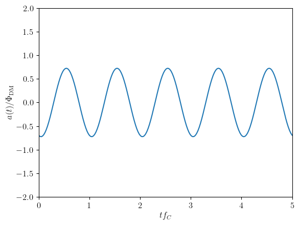
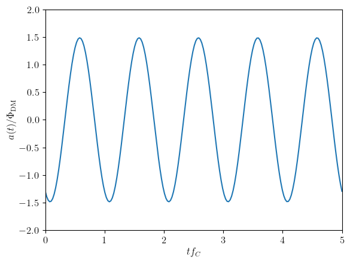
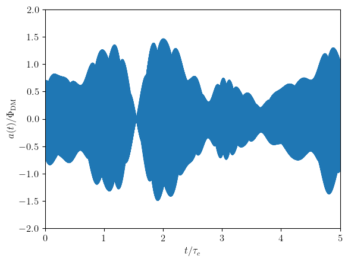

## Theory

- Compton frequency $$f_C = m_a c^2/h$$
- Broadening due to halo velocity distribution $$f_a = f_C + m_a v^2/(2h)$$
- Fields with different frequency and random phase interfere, resulting in **stochastic** behaviour[^1]
	- Coherence time $$\tau_c = c^2/(v_\mathrm{vir}^2 f_C)$$
	- For observation times $T \ll \tau_c$, the total field oscillates at the Compton frequency, with a random amplitude described by the Rayleigh pdf [^1] $$p(\Phi_0) = \frac{2\Phi_0}{\Phi_\mathrm{DM}}\exp\left(-\frac{\Phi_0^2}{\Phi_\mathrm{DM}^2}\right)$$ $$a(t) \approx \Phi_0 \cos(2\pi f_C t + \phi)$$  
	- For observation times $T\gg \tau_c$, the total field explores the whole distribution, and $$\langle \Phi_0^2\rangle = \Phi_\mathrm{DM}^2 = \frac{\hbar^2}{m_a^2 c^2}2\rho_\mathrm{DM}$$ 
	- The general expression for the axion field is given by[^2] $$a(t) = \frac{\Phi_\mathrm{DM}}{\sqrt{2}}\sum_j \alpha_j \sqrt{f(v_j) \Delta v} \cos\left[2\pi f_C\left(1+\frac{v_j^2}{2}\right)t + \phi_j \right]$$ where the sum is performed over $v_j$ samples of the local velocity distribution $f(v)$ with spacing $\Delta v$, $\phi_j \in [0, 2\pi)$ are random phases, and $\alpha_j$ is again Rayleigh-distributed, with $$p(\alpha_j)=\alpha_j \exp(-\alpha_j^2/2),\qquad \overline{\alpha_j}=\sqrt{\frac{\pi}{2}},\qquad \overline{\alpha_j^2} = 2$$

### Dark Matter speed distribution

- Standard Halo Model (SHM): $$f(v) = \frac{v}{\sqrt{\pi}v_0 v_\mathrm{obs}} \exp\left(-\frac{(v+v_\mathrm{obs})^2}{v_0^2}\right)\left[\exp\left(\frac{4 v v_\mathrm{obs}}{v_0^2}\right) -1\right]$$ where $v_0\approx 220\,\mathrm{km/s}$ is the speed of the local rotation curve and $v_\mathrm{obs}\approx 232\,\mathrm{km/s}$ is the speed of the Sun respect to the halo rest frame.
- Subleading effects
	- Halo annual modulation due to Earth's movement: $v_\mathrm{obs}(t)$
	- Halo gravitational focusing by the Sun's potential
	- Local halo substructure...

### Effect on nuclear decays

The observable of interest is[^3] $$I(t) = \frac{T_{1/2}^{-1}(\theta) - \langle T_{1/2}^{-1}\rangle}{\langle T_{1/2}^{-1}\rangle}$$ where the dependence of the lifetime on $\theta$, coming from the pion mass, can be obtained from Taylor expansion $$T_{1/2}(\theta) \approx T_{1/2}(0) + \mathring{T}_{1/2}(0) \theta^2$$ In the case of "deterministic" DM, it takes the simple form $$I(t)\approx \frac{\mathring{T}_{1/2}(0)}{T_{1/2}(0)}\frac{\langle a^2\rangle-a^2(t)}{f_a^2} \approx -\frac{1}{2}\frac{\mathring{T}_{1/2}(0)}{T_{1/2}(0)}\frac{\Phi_\mathrm{DM}^2}{f_a^2}\cos(4\pi f_C t+\phi)$$

For the generic axion field,

$$a^2(t) = \frac{\Phi_\mathrm{DM}^2}{4}\sum_{j,k} \alpha_j \alpha_k \sqrt{f(v_j) f(v_k)}\Delta v \left[\cos\Big(2\pi f_C(2 + v_j + v_k)t + \phi_j + \phi_k \Big)+\cos\Big(2\pi f_C (v_j - v_k)t + \phi_j-\phi_k\Big)\right]$$ $$\langle a^2\rangle = \frac{\Phi_\mathrm{DM}^2}{4}\sum_j \alpha_j^2 f(v_j) \Delta v = \frac{1}{2}\Phi_\mathrm{DM}^2$$
## Bibliography

[^1]: G. P. Centers _et al._, “Stochastic fluctuations of bosonic dark matter,” _Nat Commun_, vol. 12, no. 1, p. 7321, Dec. 2021, doi: [10.1038/s41467-021-27632-7](https://doi.org/10.1038/s41467-021-27632-7). [1905.13650](https://arxiv.org/abs/1905.13650)

[^2]: J. W. Foster, N. L. Rodd, and B. R. Safdi, “Revealing the Dark Matter Halo with Axion Direct Detection,” _Phys. Rev. D_, vol. 97, no. 12, p. 123006, June 2018, doi: [10.1103/PhysRevD.97.123006](https://doi.org/10.1103/PhysRevD.97.123006). [1711.10489](https://arxiv.org/abs/1711.10489)

[^3]: C. Broggini, G. D. Carlo, L. D. Luzio, and C. Toni, “Alpha radioactivity deep-underground as a probe of axion dark matter,” June 25, 2024, _arXiv_: arXiv:2404.18993. doi: [10.48550/arXiv.2404.18993](https://doi.org/10.48550/arXiv.2404.18993).
